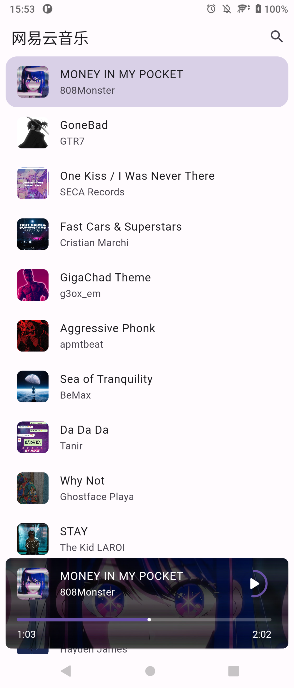
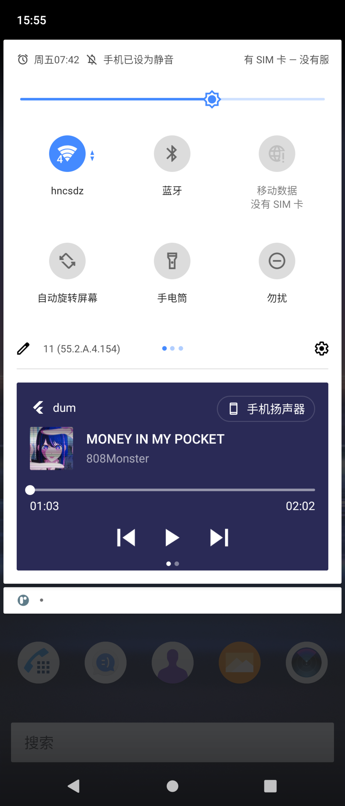

# Dum - Flutter Music Player App

基于 dum 本地音乐播放器 改造的  在线音乐播放器 使用了网易云音乐的Api
原来 dum 作者的仓库地址：https://github.com/eijiotieno-official/dum

The revamped online music player based on dum's local music player uses NetEase Cloud Music's Api

Original author dum warehouse address: https://github.com/eijiotieno-official/dum

## [View Video](https://youtu.be/_7CHcLhRh6E)

  

    

    
  

  

    

    
  

  

